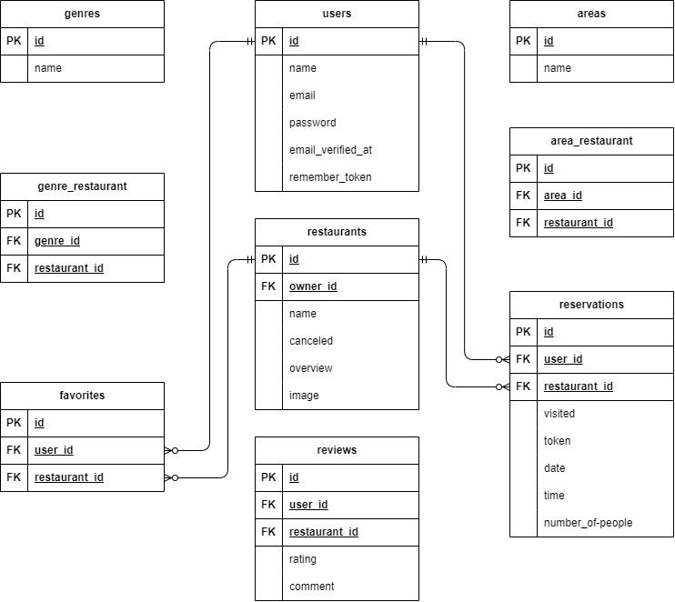

# 飲食店予約サービス Rese

## アプリケーション名

Rese(複数ジャンルの飲食店を検索・予約・レビューできる Web アプリ)


## 概要説明

ユーザーは会員登録後、店舗の検索・お気に入り登録・レビュー投稿ができ、
店舗代表者と管理者はそれぞれ管理機能を操作できます。
作成した背景としては、プログラミングスクールで学んだ Laravel の知識を定着させるため、実際にフルスタックな Web アプリを開発してみたいと考えたためです。
特に「ユーザー権限管理」や「予約管理」「レビュー投稿」など、実務で頻出する機能を体系的に実装することを目的としています。

## アプリケーション URL

http://54.253.215.202/

## 他のリポジトリ

なし

## 機能一覧

| 機能カテゴリ       | 機能名                     | 概要                                                |
| ------------------ | -------------------------- | --------------------------------------------------- |
| **認証機能**       | ユーザー登録機能           | 一般ユーザーがメール認証付きで登録する              |
|                    | ログイン機能               | 一般ユーザー・管理者・店舗代表者のログイン          |
|                    | ログアウト機能             | 各ユーザーがログアウト                              |
|                    | メール認証機能             | 登録後、認証リンクをクリックして有効化              |
| **店舗閲覧機能**   | 店舗一覧表示               | 飲食店一覧をトップページで表示                      |
|                    | 店舗詳細表示               | 各店舗の情報（写真・概要・エリア・ジャンル）を表示  |
|                    | 店舗検索機能               | エリア・ジャンル・キーワードによる検索              |
| **予約機能**       | 店舗予約登録               | 利用者が来店日時・人数を指定して予約                |
|                    | 予約一覧表示（マイページ） | 自分が予約した一覧を確認                            |
|                    | 予約内容変更               | 予約の日時や人数を変更（`edit`, `update`）          |
|                    | 予約キャンセル             | 利用者が自分の予約をキャンセル                      |
|                    | QR コード表示              | 自身の予約を QR コード化して表示（`mypage.verify`） |
|                    | QR コード照合              | 店舗側が QR コードを照合し「来店済み」に変更        |
| **レビュー機能**   | レビュー投稿機能           | 来店済みの予約に対して評価・コメントを投稿          |
|                    | 店舗ごとのレビュー一覧表示 | 店舗詳細ページや管理画面でレビューを確認            |
| **お気に入り機能** | いいね（お気に入り）機能   | 飲食店を「お気に入り」に登録・解除                  |
| **マイページ機能** | プロフィール閲覧           | ログイン中のユーザー情報と予約履歴を表示            |
| **管理者機能**     | 管理者ダッシュボード       | オーナーの登録・一覧管理など                        |
|                    | 店舗代表者の登録           | 管理者がオーナーアカウントを作成                    |
|                    | 利用者への一括メール送信   | お知らせメールなどを全ユーザーに送信                |
| **店舗代表者機能** | 店舗情報登録・更新         | 自分が管理する店舗の情報を編集（`create`, `edit`）  |
|                    | 予約一覧管理               | 予約一覧を確認し、来店確認・キャンセル対応          |
|                    | レビュー閲覧               | 自店舗に投稿されたレビューを確認                    |

## 環境構築

**Docker ビルド**

1. git clone git@github.com:差し替えます
2. DockerDesktop アプリを立ち上げる
3. `docker-compose up -d --build`

> _Mac の M1・M2 チップの PC の場合、`no matching manifest for linux/arm64/v8 in the manifest list entries`のメッセージが表示されビルドができないことがあります。
> エラーが発生する場合は、docker-compose.yml ファイルの「mysql」内に「platform」の項目を追加で記載してください_

```bash
mysql:
    platform: linux/x86_64(この文追加)
    image: mysql:8.0.26
    environment:
```

**Laravel 環境構築**

1. `docker-compose exec php bash`
2. `composer install`
3. 「.env.example」ファイルを 「.env」ファイルに命名を変更。または、新しく.env ファイルを作成
4. .env に以下の環境変数を追加

```text
DB_CONNECTION=mysql
DB_HOST=mysql
DB_PORT=3306
DB_DATABASE=laravel_db
DB_USERNAME=laravel_user
DB_PASSWORD=laravel_pass

MAIL_MAILER=smtp
MAIL_HOST=mailhog
MAIL_PORT=1025
MAIL_USERNAME=null
MAIL_PASSWORD=null
MAIL_ENCRYPTION=null
MAIL_FROM_ADDRESS=example@example.com
MAIL_FROM_NAME="Rese"

STRIPE_SECRET_KEY=sk_test_
STRIPE_PUBLIC_KEY=pk_test_
```

5. アプリケーションキーの作成

```bash
php artisan key:generate
```

6. マイグレーションの実行

```bash
php artisan migrate
```

7. シーディングの実行

```bash
php artisan db:seed
```

8. シンボリックリンク作成

```bash
php artisan storage:link
```

## 使用技術(実行環境)

- PHP8.3.0
- Laravel8.0
- MySQL8.0.26
- Docker / docker-compose
- Mailhog（開発用メールサーバ）

## ER 図



## URL

- 開発環境：http://localhost/
- Mailhog： http://localhost:8025
- phpMyAdmin:：http://localhost:8080/
